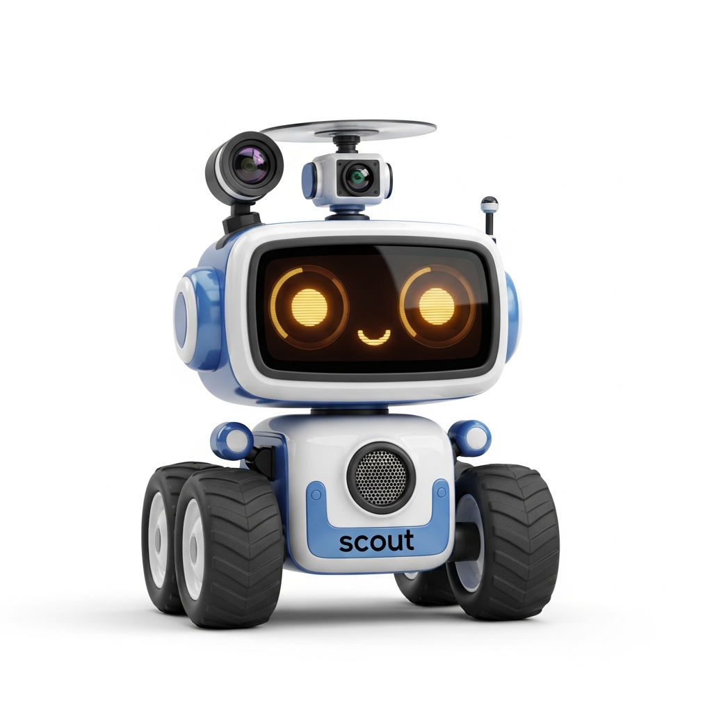
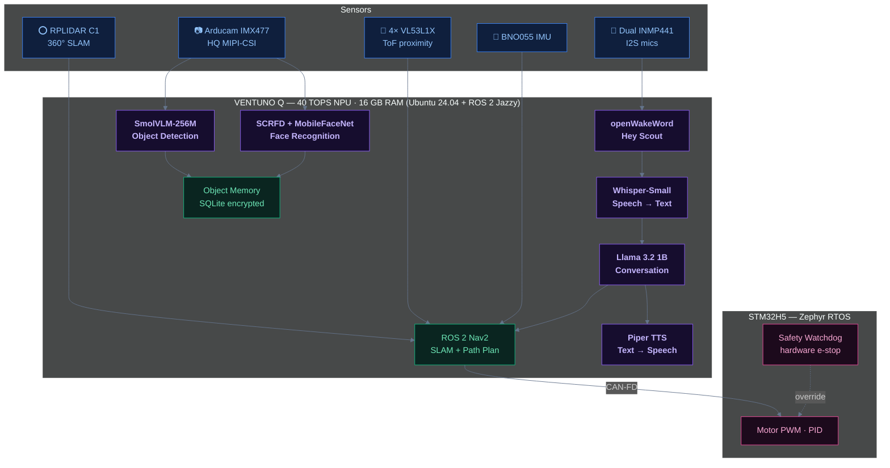

<p align="center">
  
</p>

<h1 align="center">Home Scout</h1>

<p align="center">
  <strong>A privacy-first home companion robot you build with your family.</strong><br>
  Voice assistant. Object memory. Face recognition. Zero internet. All local.
</p>

<p align="center">
  <a href="LICENSE"></a>
  <a href="https://github.com/m4cd4r4/home-scout/actions/workflows/ros2-ci.yml"></a>
  <a href="https://github.com/m4cd4r4/home-scout/actions/workflows/firmware-ci.yml"></a>
  <a href="https://github.com/m4cd4r4/home-scout/pulls"></a>
</p>

<p align="center">
  <a href="#what-is-scout">What is Scout?</a> &bull;
  <a href="#build-phases">Build Phases</a> &bull;
  <a href="#quick-start">Quick Start</a> &bull;
  <a href="#privacy">Privacy</a> &bull;
  <a href="#architecture">Architecture</a> &bull;
  <a href="#contributing">Contributing</a>
</p>

---

## What is Scout?

Scout is an open-source home companion robot you build with your family. It patrols your house, remembers where objects are, greets family members by name, and answers questions - all without ever connecting to the internet.

> "Scout, where are my keys?"
> *"I last saw your keys on the kitchen counter about 2 hours ago."*

The brain is an [Arduino VENTUNO Q](https://www.arduino.cc/) - a dual-processor board pairing a Qualcomm Dragonwing IQ-8275 (40 TOPS NPU, 16GB RAM) with an STM32H5 real-time controller. One board handles voice recognition, object detection, navigation, and face recognition. All locally.

Privacy is not a feature - it is the architecture. Scout has no Wi-Fi antenna pointed at the internet, no cloud account, no telemetry. Every byte of data stays on the robot. Face embeddings are encrypted at rest. Audio is never saved. You can audit the entire system with a single script.

## Build Phases

Scout is designed to be built incrementally. Each phase produces a working robot. Start with Phase 1 and add capabilities over time.

### Phase 1: Scout Can Talk (~$362)

> Microphone, speaker, and a local LLM. One afternoon to build.

<details>
<summary>What can Scout do?</summary>

- Responds to "Hey Scout" wake word
- Answers questions using Llama 3.2 1B running on the NPU
- Tells jokes, sets timers, reads recipes
- Configurable voice and personality
- Runs from a desk or shelf - no wheels needed

</details>

### Phase 2: Scout Can See (+$64)

> Add a camera. Scout detects and identifies household objects.

<details>
<summary>What can Scout do?</summary>

- Detects objects via SmolVLM-256M on the NPU at 2 Hz
- "Scout, what do you see?" - describes objects in view
- Multi-object tracking with stable IDs across frames
- Optional ESP32-S3-CAMs for fixed room monitoring

</details>

### Phase 3: Scout Can Move (+$569)

> Wheels, motors, LIDAR, and autonomous navigation.

<details>
<summary>What can Scout do?</summary>

- Maps your house using RTAB-Map SLAM
- Navigates between rooms via Nav2
- Runs patrol routes on a schedule
- 4-layer obstacle avoidance (LIDAR + ToF + cliff + bump)
- Hardware e-stop button kills all motor power instantly
- STM32H5 watchdog stops motors if Linux crashes

</details>

### Phase 4: Scout Remembers (+$0)

> Software-only. Scout remembers where it saw household objects.

<details>
<summary>What can Scout do?</summary>

- "Scout, where are my keys?" - tells you the room, zone, and when
- SQLite + FTS5 spatial database with confidence decay
- Portable items decay fast (4h half-life), furniture decays slow (1 week)
- Natural language aliases: "my phone" maps to "phone"
- Configurable retention (default 30 days)

</details>

### Phase 5: Scout Knows Us (+$0)

> Software-only. Face recognition with encrypted embeddings.

<details>
<summary>What can Scout do?</summary>

- "Good morning, Sarah!" - greets family by name
- Time-of-day aware greetings with per-person cooldown
- Consent-required enrollment (5 seconds in front of camera)
- 128-d face embeddings encrypted at rest (AES-256-GCM)
- No face images ever saved

</details>

### Phase 6: Sky Eye (+$133, optional)

> Indoor micro drone companion for elevated views.

<details>
<summary>What can Scout do?</summary>

- Small indoor drone streams video back to Scout for VLM inference
- Checks high shelves, tops of cabinets, above furniture
- Prop guards required, strict flight boundaries
- This phase is a design outline - contributions welcome

</details>

---

**Total cost across all phases: ~$1,128** (or ~$362 for voice-only Phase 1)

## Quick Start

### Simulation (no hardware)

```bash
git clone https://github.com/m4cd4r4/home-scout.git
cd home-scout
docker compose up sim
```

### Real Hardware (Phase 1)

```bash
git clone https://github.com/m4cd4r4/home-scout.git
cd home-scout
./scripts/setup-ventuno.sh

source /opt/ros/jazzy/setup.bash
source ros2_ws/install/setup.bash
ros2 launch scout_bringup scout_voice_only.launch.py
```

Say **"Hey Scout"** and ask a question. See the [Phase 1 Build Guide](docs/build-guides/phase-1-voice.md) for the full walkthrough.

## Privacy

| Principle | Implementation |
|-----------|---------------|
| No internet | Scout creates its own WiFi AP (ScoutNet). No default gateway. No DNS. |
| All AI local | Whisper, Piper TTS, Llama 3.2 1B, SmolVLM, ArcFace - all on the 40 TOPS NPU |
| No telemetry | Zero analytics, zero crash reports, zero usage data |
| Encrypted faces | 128-d embeddings encrypted with AES-256-GCM. Key from user passphrase via Argon2id |
| Audio not saved | Processed in circular buffer, discarded after transcription |
| Hardware mic mute | Physical slide switch disconnects I2S clock line |
| Camera LED | Wired to camera power. If the LED is off, the camera is off. Hardware guarantee. |
| Auditable | `scripts/verify-privacy.sh` checks network isolation, DNS, traffic, listening services |

## Architecture

```
+----------------------------------------------------------+
|              VENTUNO Q  (Ubuntu 24.04 + ROS 2 Jazzy)     |
|                                                          |
|  +----------+  +----------+  +---------+  +------------+ |
|  |  voice   |  |  vision  |  |   nav   |  |   memory   | |
|  | Phase 1  |  | Phase 2  |  | Phase 3 |  |  Phase 4   | |
|  +----------+  +----------+  +---------+  +------------+ |
|  +----------+  +--------------------------------------+  |
|  |  faces   |  |         hardware_bridge              |  |
|  | Phase 5  |  +------------------+-------------------+  |
|  +----------+                     | CAN-FD                |
+-----------------------------------+----------------------+
|              STM32H5  (Zephyr RTOS)                      |
|   Motor PWM | Encoders | PID | Safety Watchdog           |
+----------------------------------------------------------+
```

### AI Models (all local, 40 TOPS NPU)

| Model | Purpose | Size |
|-------|---------|------|
| openWakeWord | "Hey Scout" detection | 2 MB |
| Whisper-Small-En | Speech recognition | 500 MB |
| Piper TTS (amy) | Speech synthesis | 100 MB |
| Llama-3.2-1B-Instruct | Conversation | 1.5 GB |
| SmolVLM-256M | Object detection (VLM) | 1.5 GB |
| SCRFD-2.5G | Face detection | 10 MB |
| MobileFaceNet | Face embedding | 10 MB |

Total: ~3.6 GB disk, ~5.4 GB RAM. Leaves 10.6 GB free on the 16 GB board.

See [ARCHITECTURE.md](docs/ARCHITECTURE.md) for full system design, NPU scheduling, object memory schema, and network topology.



## Hardware

| Part | Model | Cost |
|------|-------|------|
| Main board | Arduino VENTUNO Q | ~$300 |
| Storage | Samsung 970 EVO Plus 250GB NVMe | ~$40 |
| Audio | 2x INMP441 mics + MAX98357A amp + speaker | ~$17 |
| Camera | Arducam IMX477 HQ MIPI-CSI | ~$60 |
| Motors | 4x Pololu 37D 50:1 with encoders | ~$100 |
| Chassis | 3D printed or off-the-shelf 4WD kit | ~$35 |
| LIDAR | SLAMTEC RPLIDAR C1 | ~$100 |
| Sensors | BNO055 IMU + 4x VL53L1X ToF + 2x TCRT5000 cliff | ~$90 |
| Power | 4S LiPo + BMS + buck converter | ~$97 |
| Connectors | JST-XH, cables, standoffs, fuse | ~$70 |

Full BOM with 3 price tiers and alternatives: [BOM.md](BOM.md)

## Repository Structure

```
home-scout/
  ros2_ws/src/          # 8 ROS 2 packages (voice, vision, nav, memory, faces, ...)
  firmware/             # STM32H5 motor control + ESP32-CAM streaming
  hardware/             # 3D printable chassis, wiring schematics, mounts
  config/               # Personalities, patrol routes, room maps
  docs/                 # Build guides (6 phases), reference, design docs
  training/             # Wake word, object detection, face recognition guides
  tests/                # Unit, integration, simulation, hardware tests
  scripts/              # Setup, model download, privacy verification
  docker/               # Dev and simulation environments
```

## Contributing

Contributions of all kinds are welcome - code, docs, hardware designs, 3D models, testing.

```bash
git clone https://github.com/m4cd4r4/home-scout.git
cd home-scout
docker compose up dev
```

### No hardware? No problem.

- Write tests using the Gazebo simulation
- Improve documentation and build guides
- Design 3D-printable chassis variants
- Optimize AI models for edge deployment
- Add language support (wake words + TTS voices)
- Review code for security and privacy

See [CONTRIBUTING.md](CONTRIBUTING.md) for the full guide.

## Safety

Read [SAFETY.md](SAFETY.md) before building. Key points:

- E-stop is mandatory for Phase 3+. Cuts all motor power instantly.
- LiPo battery handling requires adult supervision. Never charge unattended.
- Phase 6 (drone) is adults-only. Indoor drones require careful tuning.
- Max speed software-limited to 0.3 m/s (enforced independently by STM32H5).
- STM32H5 watchdog: if Linux crashes, motors stop within 100ms.

## License

[MIT](LICENSE). Build it. Modify it. Share it. Teach your kids how robots work.

---

<p align="center">
  <strong>Scout never phones home. That is the point.</strong>
</p>
